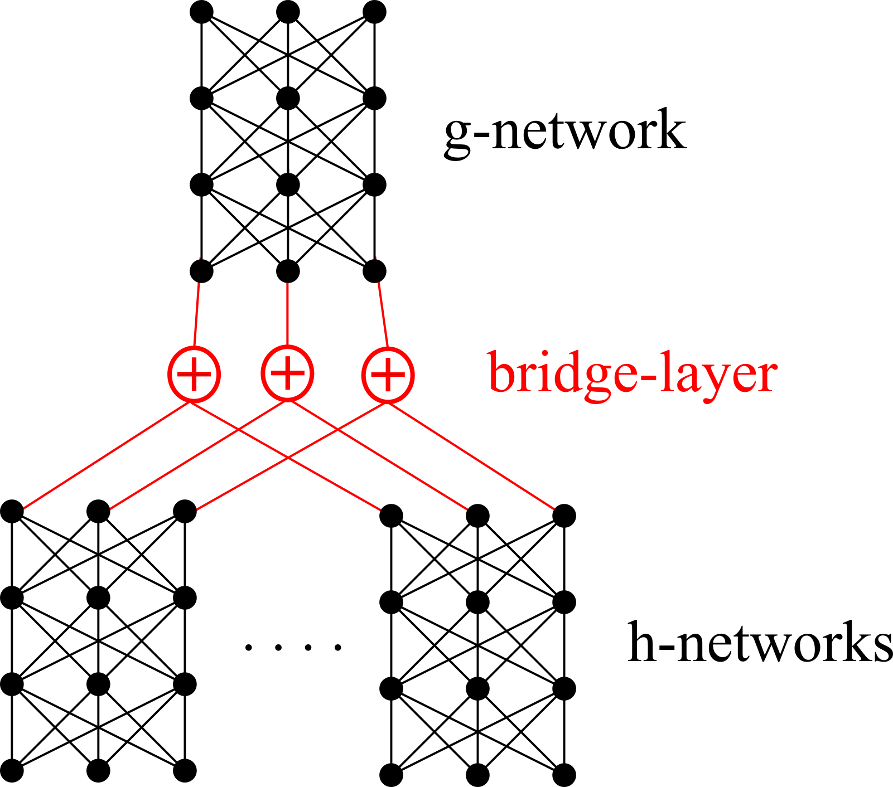

# Symmetric Neural Network

We implement symmetric neural networks based on the form

    f(x, y, ...) = g(h(x) + h(y) + ...)

where g and h are nonlinear functions (implemented as neural networks).  This idea comes from the PointNet [2017] and DeepSet [2018] papers.

## Mathematics

The functional form above is inspired by the **Kolmogorov-Arnold representation** of continuous functions, specialized to the case of symmetric functions in the DeepSet paper.

The PointNet paper (published 1 year earlier) seems to have independently discovered this form.

Both papers' proofs employ an "exponentiation" idea that seems crucial to the proofs.

## Implementation

The following is a schematic diagram of the full network:

The code is not difficult to write once we realize that the "bridge" can be regarded as a neural network layer with sparse weights.
